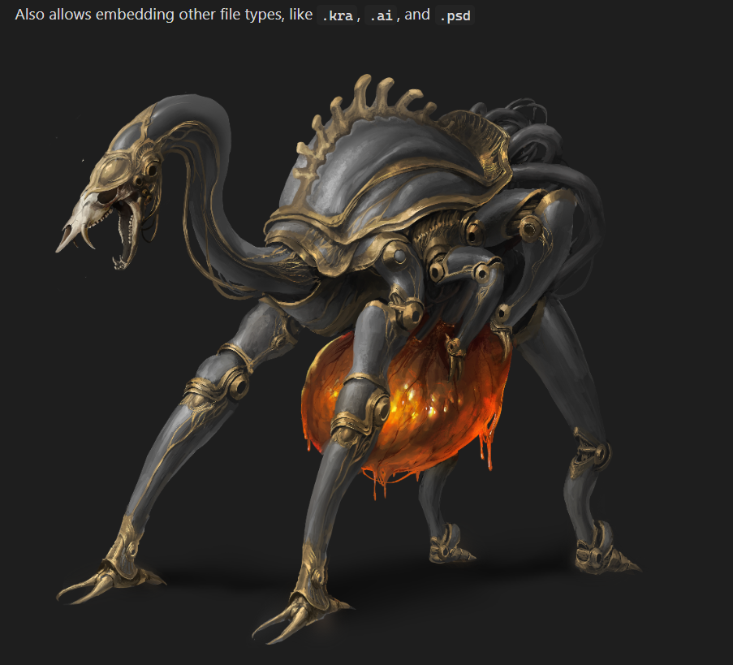
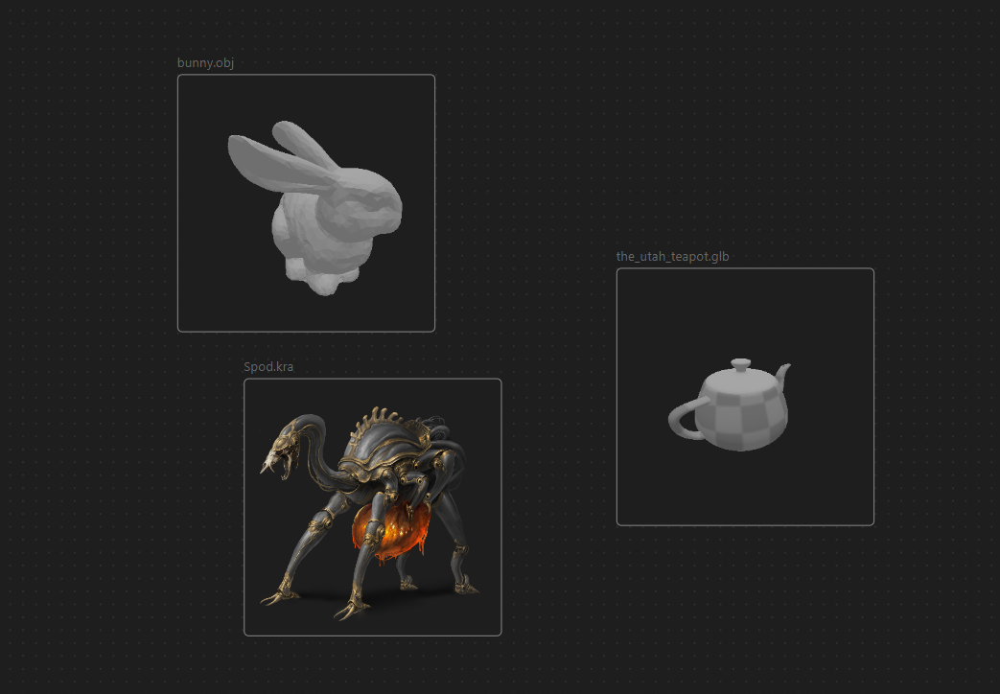

# Extended File Support for Obsidian

This plugin aims to add viewing and embedding support for various file types in Obsidian. 
It does *not* aim to allow these files to be edited. 
This is considered to be outside of the scope of this plugin.

File types can be toggled in the settings.

*`.kra` file provided and made by Tio Tzen Ann ([Artstation](https://www.artstation.com/greasetanker), [Instagram](https://www.instagram.com/bullyinggnomes/)).*

*Also works in Canvas.*

# Currently Supported

The file types that are currently supported are:

- `.kra` (Files made in Krita)
- `.psd` (Photoshop, other visual programs)
- `.ai` (Adobe Illustrator)
- `.clip` (Clip Studio Paint)
- `.gltf`, `.glb` (3D scene format)
- `.obj` (3D object format)
- `.stl` (3D format, often used for 3d printing)

## Settings

When embedding files, the following settings can be added as `![[file.ext|setting1=value;setting2=value]]` or ``.

**All files**:

- `width` or `widthxheight` in which both `width` and `height` are numbers. Follows the way images are embedded in Obsidian, and allows for the width and height of the embed to be changed.

**3d files** (`.obj`, `.gltf`, `.glb`, `.stl`):

- `spin=true` or `spin=false`, overrides the default setting on whether to animate 3d models.
- `camPos=x,y,z` in which `x`, `y`, and `z` are the coordinates the camera should have.
- `camLookAt=x,y,z` in which `x`, `y`, and `z` are the coordinates the camera should look at.

Note that with spin/animation enabled, `camPos` will not work, and `camLookAt` may not have the desired behavior, because the camera moves around.
Additionally, 3d objects that are loaded in are placed on `(0, 0, 0)` and scaled to fit in a unit cube.

**`.ai` files**:

- `scale=number`, will override the default setting for `.ai` file scaling. High values might cause high loading time.

## Contributing

If you wish to contribute to the plugin, feel free to open a pull-request or an issue.
If you're thinking about implementing a large feature, please open an issue first or contact me on discord at `n_1ck` 
so we can figure out if it's a good fit for this plugin.
